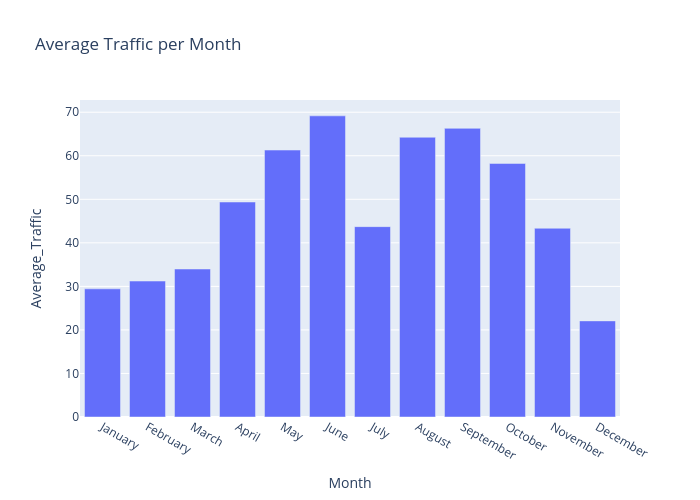
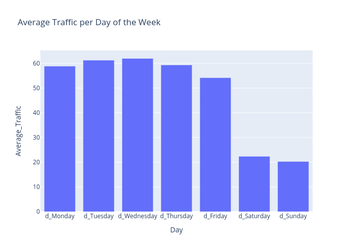
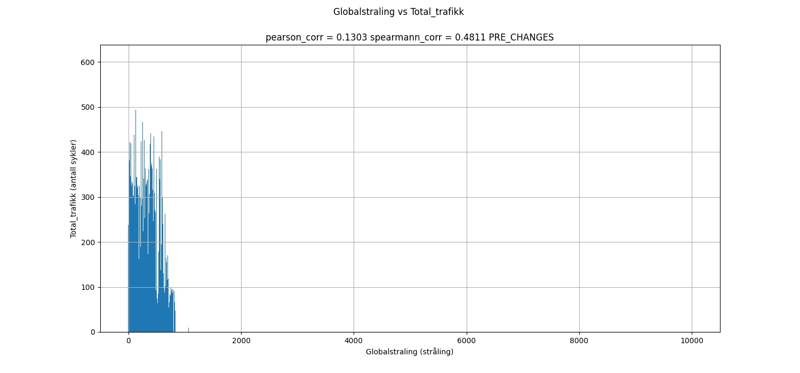
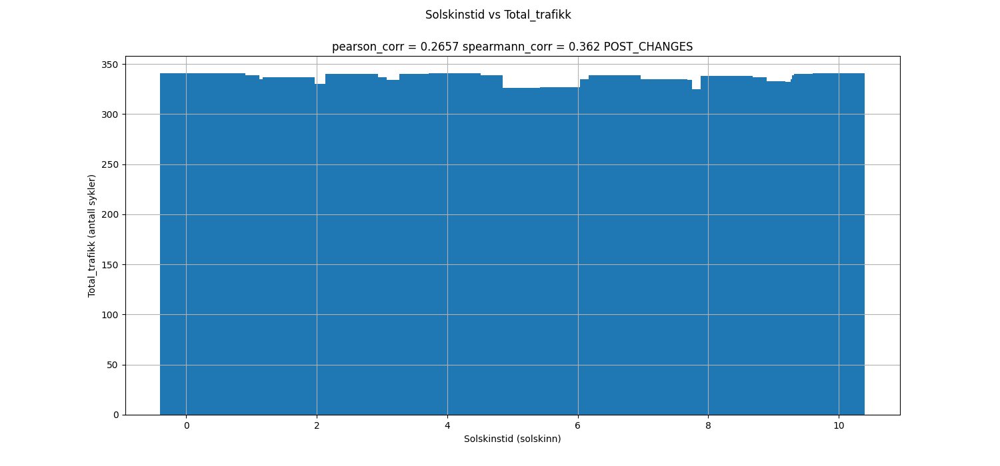
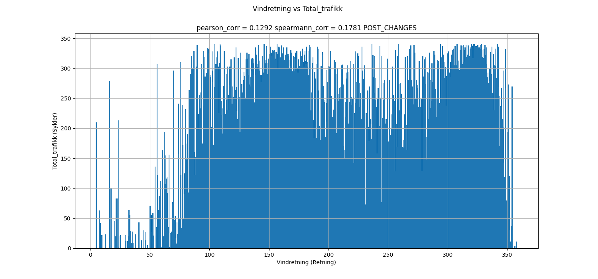
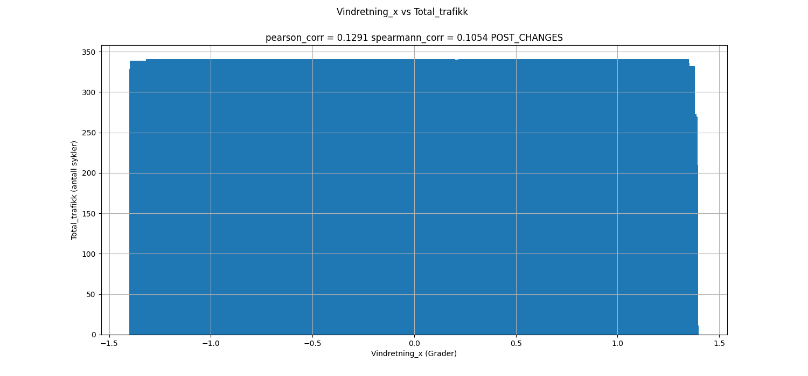
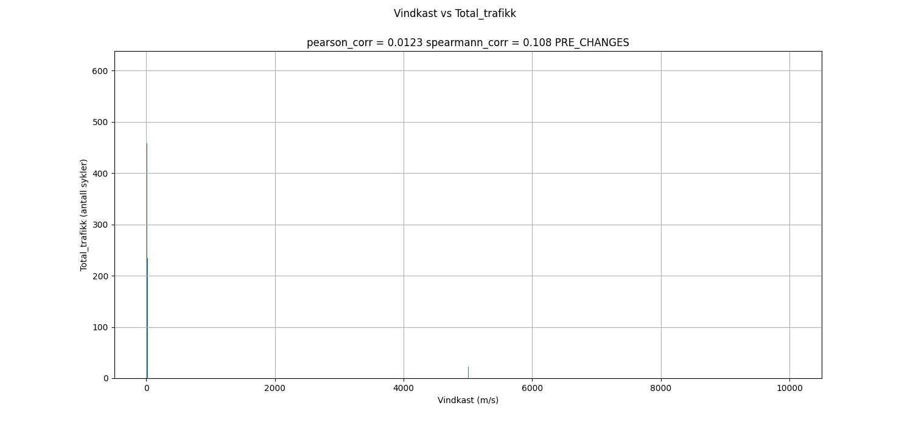
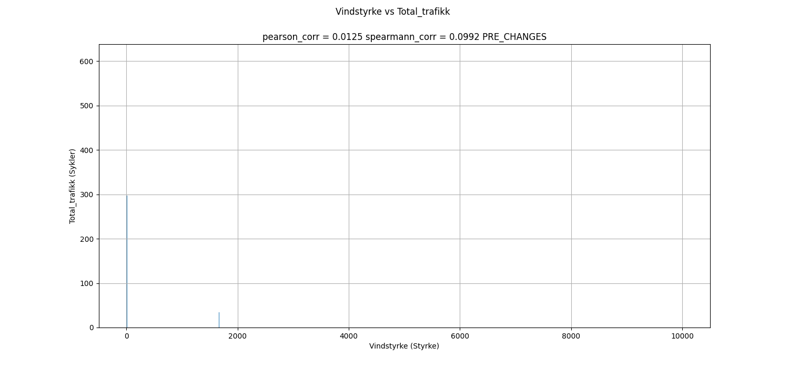
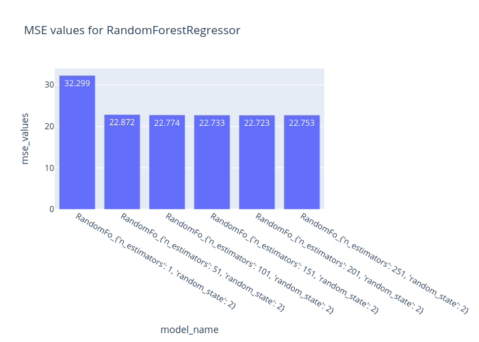
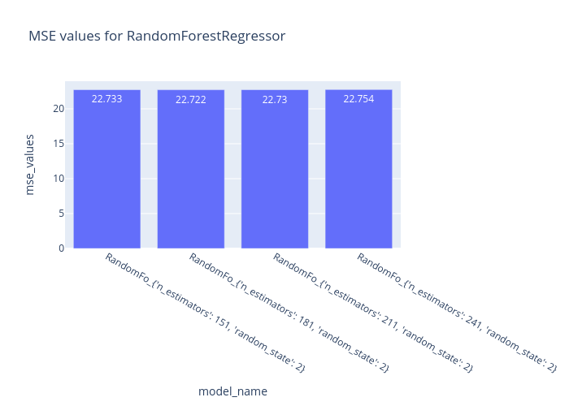

### REPORT

- LOOK MORE MAKE CLEAN

- GOOGLE DOCS


### CODE

- cleanup files that may not be used

- cleanup

- conda and lock file

# Report for INF161 cycle traffic project

***If I'm not in PDF format, please open me in markdown formatting! (in vscode there is a button in the top right.)***

*Henrik Brøgger*

This report pertains to the INF161 project this fall, in creating a model which can guess bike traffic across nygårdsbroen.

### Index:

- Data Exploration
- Removed data / Data loss
- Feature engineering
- Issues/Choices
- Data exploration post processing
- Model choice and evaluation
- Results
- Conclusion


## Approach and design choices

Given multiple files describing weather, and a single file describing traffic, there were hurdles to get over, and choices to make in order to create a DataFrame which an eventual model could learn from.

### Issues/Choices

*Parsing*

Simply opening the traffic data in a nice format was a challenge. The trafficdata.csv uses both "|" and ";" as seperators. The solution was to open the file as a string, replace all "|" with ";" and then open the file with pandas.

*Difference in data spacing*

The weather data has 6 data points per hour, (for every 10 minutes), however the traffic data only has 1 data point per hour. The solution to this misalignment was taking the mean of the 6 values makign up an hour in the weather data. 
The end goal is to predict weather for a given hour, and so converting the traffic per hour for minutes by dividing by 6 would not be favourable, as now the model would guess for each 10 minutes in an hour. Taking the mean of values is an area where quite a lot of data may be lost through "compression".

*Time frame differences*

One issue that is quikcly observed is that the time frame is different between the two data sets. Traffic data is only in the range:
*2015-07-16 15:00:00* - *2022-12-31 00:00:00* meanwhile weather data is in much longer from 2010-2023. The solution is to merge the two files, and drop all the dates with missing values for traffic data. This loss of data is unfortunate, but it is impossible to train a model for traffic data if there is no traffic data.

*Data loss*

A choice that was made was also to completely remove the "Relativ luftfuktighet" coloumn in the weather files. This is because this column only existed in the 2022 and 2023 data files. The overall data exists in the timeframe 2017-2022 and so this column has a lot of missing data, and would very hard to incorporate into a model. However, a coloumn for "rain" would be very useful, and this is added further into the report. 

*Test train split*

In order to validate model efficacy, and check for over-training, a test-train-split process was used in order to observe model generalization. 70% of data was used as training data, while the remaining 30% was split into two parts of 15%, going to validation and test data. 

### *Note* 
The data processing part of the report appears before the data exploration part as data exploration showcases data pre and post processing. It is essential to know the processing done to understand the outcome of the data expolration.

## Data processing

This section goes over the treatment of outliers, and other processing steps. 

Values that were deemed as outliers such as "99999" were transformed into NaN.
Follwing this step, these NaN were transformed into real values by a KNNImputer, with settings *weights* = distance, since this pertains to date data. When mentioning that "x" data points were transformed to NaN, this includes the 99999 data points as well as those outside the borders specified in each section.

```
Number of NaNs in each column: (training data)
Globalstraling              85
Solskinstid                 94
Lufttemperatur             169
Vindretning                278
Vindstyrke                 169
Lufttrykk                  169
Vindkast                   169
Relativ luftfuktighet    45746
```


- *Globalstråling*

<p> Values over 1000 in **Globalstraling** are considered malformed. </p>
114 data points are transformed into NaN.

This value was chosen because values over this are only observed "ved atmosfærenses yttergrense"

[ref]("https://veret.gfi.uib.no/") 

- *Solskinnstid*

<p>
Values above 10.01 in **Solskinstid** are are considered  malformed</p>
123 data points are transformed into NaN. 

The solskinstid scale is between 0-10

[ref]("https://veret.gfi.uib.no/") 

- *Lufttrykk*

<p>
Values above 1050 in **Lufttrykk** are considered malformed. </p>
506 data points turn into NaN.

935 and 1050 are the min/max records of all time. 

[ref]("https://en.wikipedia.org/wiki/List_of_atmospheric_pressure_records_in_Europe") 


- *Luftemperatur*

<p>
Values above 37 in **Lufttemperatur** are considered malformed. </p>
507 values are turned into NaN.

Over 37 degrees is not realistic for norway, as the warmest ever recorded was 35.6 degrees

[ref]("https://no.wikipedia.org/wiki/Norske_v%C3%A6rrekorder") 

- *Vindkast*

<p>
Values above 65 in **Vindkast** are considered malformed </p>
506 values are considered NaN.

Over 65m/s is not realistic for norway, as the highest value ever recorded was 64,7m/s

[ref]("https://no.wikipedia.org/wiki/Norske_v%C3%A6rrekorder") 

- *Vindretning*

<p>
Values above 360 in **Vindretning** are considered malformed </p>
669 values are lost.

Since vindretning is measured from 0-360, there is no way a degrees of more than 360 could be measured.

- *Vindstyrke*

Values above 1000 are considered malformed.

There are 506 missing values here, but this col is dropped in favour of "Vindkast" anyway, as they are so correlated.

- *Relativ luftfuktighet*

This coloumn is dropped from the start, since there is so much missing data (56513 NaN values)

- Outliers in traffic data

 

Looking at traffic data above, a clear peak was the year 2017, where there was a cycling competiton in bergen. These outliers may effect the data, as there is not a large scale cycling competion every year.
Values in the 99th percentile were removed, in hopes of normalizing data each year, so that the model can understand trends across months, not a trend which occoured one year. 

*For training data:*
Values pre removal of outliers: 45746
Values post removal of outliers: 45290

So 456 values were removed, so not a lot relative to the entire dataset.

This choice is a toss-up because the model will become generally better at guessing mean values, but will struggle on predicting high values. 

This also removes the bottom 99th percentile, again making the model worse at guessing very low values, but better at general values. The hope is that the model is able to understand that at night there are less cyclists, through other variables/features.


 

#TODO COMMENT ON THIS

Now after removing outliers, data is more uniform across years.


# Data exploration:
In figs, there are images presenting each of the coloums in the final data frame, plotted against the total amount of traffic. This part of the report explores these figures.

# Variations within time



Certain months have different amounts of mean traffic, so providing the model the month will help it understand this correlation. I am using dummies from python in order to setup a coloumn for each month. 



Certain days have different amounts of mean traffic, so providing the model the day will help it understand this correlation. I am using dummies from python in order to setup a coloumn for each day. 

<!--  -->

Certain hours differ in traffic amounts, and this will be a key aspect of the model to understand.


It is also important to note that within an hour, there is alot of variation between the highest and lowest amounts.

### Yearly variations of traffic data / Correlation of the two directions


Looking at the *FloridaDanmarksplass vs time* graph above, one can see that the two variables describing the amount of people driving each direction are very correlated.

Both of the statistical tests back this up aswell, having high values of: pearson = *0.0407* and spearmann = *0.8269
It is for this reason i have chosen to combine the two variables into one, as a "total traffic variable". In hindsight, the two variables must be combined, as in order to predict total traffic, the input data should be total traffic. 

This graph also visualizes a large cycling peak in 2017, due to a large bicycle competion happening that year. 
This is the cause of a great deal of outliers. The solution to this is removing data which sits in the 99th percentile. The model does not need to be good at guessing when the next large scale bicycling competiton is, it is more about day to day cycling. 


### Correlation matrix

**Raw-observation**


Looking at the *Corr matrix* graph above, it tells us that the data needs to be processed, as values are all over the place, most probably due to outliers.

**Post-processing**


The variables *Globalstråling* and *Solskinnstid* have a high degree of correlation, at 0.68.
This is high, but not high enough that they tell us the same thing, so i am going to keep both variables. It is also important to note that both variables have a decent degree of correlation with *Total_trafikk*, so they could both be very important.

The variables *Luftemperatur* and *Globalstråling* are also quite correlated, as expected, but they only have a pearson correlation of *0.41*, so keeping both values here, (espeically since they both correlate so well with *Total_trafikk*) is the correct choice. 

The variables which seem to have a good correlation with *Total_trafikk* are:

- Globalstråling (**0.29**)

- Solskinnstid (**0.24**)

- Lufttemperatur (**0.26**)

- Vindretning_x/Vindretning_y (~ +/- **0.12~**)


Data is staistically analysed using spearmann and pearson correlation.

-------------

### Globalstråling

**Raw-observation**



Looking at the figure above , it is clear that the data contains outliers, as a the amount of global radation cannot exceed many thousands. #TODO REFRENCE

**Post-processing**


After processing this data, treating outliers, one can see that the data sits between values of .-4 to 900.

It is clear that there is some correlation between globalstråling and cycle-traffic. 

There seems to be little difference in correlation when globalstråling lies between 0-400, but in values over this, and especially over 600, traffic decreases. 

With a pearson corr value of *0.2985*, this is decently strong, but can still be a good indicator of correlation.

The spearmann correlation value of *0.4716* is a good sign. Due to the nature of the data "jumping"  up and down, (meaning that that for one given globalstråling `n`, it can have values a 300, while `n+1` has 150, and `n+2` has 300 again). The spearmann value may not be as useful here, as it is most useful when observing monotonic data.

-------------

### Lufttemperatur

**Raw-observation**


Looking at the figure above , it is clear that the data contains outliers, and the data seems to pool weirdly around certain values. This needs to be adjusted for. 

**Post-processing**


After processing this data, treating outliers, one can see that the data sits between values of -10-32.

It is clear that there is some correlation between temperature and cycle-traffic. 

There seems to be little difference in correlation when lufttemperatur lies between 3-20, but in values over 20, and values under 3, traffic decreases. 

With a pearson corr value of *0.2783*, this decently strong, but can still be a good indicator of correlation.

The spearmann correlation value of *0.3405* is a good sign. However, this data is not monotic, as it goes up, then down later. This means that the spearmann correlation cannot be trusted to a large extent.

-------------

### Lufttrykk

**Raw-observation**


Looking at the figure above , it is clear that the data contains outliers, and the data seems to pool weirdly around certain values. This needs to be adjusted for. 

**Post-processing**


Looking at the *Lufttrykk vs Total_trafikk* graph above, it may seem like there is a correlation between the two. It seems that values around 980-1020 provide around the same amount of cyclists. Values higher than 1020 and lower than 980 causes a drop off inn traffic.

With a pearson corr value of *0.0714*, this is not very strong at all, despite what it may seem at first look.
The spearmann correlation value of *0.0818* is also a bad sign, but the spearmann corr may not be as good of an indicator as the pearson corr since this data is not monotonic.

-------------

### Solskinnstid

**Raw-observation**


Looking at the figure above , it is clear that the data contains outliers, and the data seems to pool weirdly around certain values. This needs to be adjusted for. 

**Post-processing**



Looking at the *Solskinn vs Total_trafikk* graph above, it may be hard to spot a correlation between the two. It seems that solskinnstid does not effect the amount of cyclists. 

However, with a pearson corr value of *0.2623*, this indicates atleast a casual correlation. This data will still be useful.
The spearmann correlation value of *0.3616*  is ok, but the spearmann corr may not be as good of an indicator as the pearson corr since this data is not monotonic.

-------------

### Vindretning

**Raw-observation**


Looking at the figure above , it is clear that the data contains outliers, and the data seems to pool weirdly around certain values. This needs to be adjusted for. 

**Post-processing**



Looking at the *Vindretning vs Total_trafikk*  graph above, it is up for argument if there is a strong correlation between the two, but there is some data that can be useful.
It seems that between x=100-350 values are pretty much consistent, however a drop is seen at around 250. Values between 100-0 are also very very low, and could be reflective of something else? Vindretning and traffic seem to be correlated, but these vindretning values can be further processed, to try to extract further data from the wind.  




This data has been transformed quite a bit. Vindretning was originally a number between 0-360, and has transformed to two values. The degrees (0-360) can be imagined as points on a unit circle. 
Converting this point to two sperate values, x and y reveal more about the nature of the wind. Originally only the wind direction was known, but now the wind x and y directions are known, or atleast simulated.

Mathematically speaking:
```
    df["Vindretning_radians"] = np.radians(df["Vindretning"])
    df["Vindretning_x"] = np.cos(df["Vindretning_radians"])
    df["Vindretning_y"] = np.sin(df["Vindretning_radians"])

```

Looking at the *Vindkast x/y vs Total_trafikk* graphs above, it is not right away clear that vindkast has a correlation with cycle traffic.
The original undivided data had a slightly positive pearson correlation of *0.139*, but now after splitting the data in two, it is clear that *Vindretning_x* has a positive pearson corr of *0.1283* while *Vindretning_y* has a negative correlation of *-0.1107*. Splitting this value into two allowed us to gain a deeper understanding of this value, understanding that some vindretning is negativley correlated!
Since vindretning has been transformed to two different variables, the original "Vindretning" has been dropped.

-------------

### Vindkast 

**Raw-observation**



Looking at the figure above , it is clear that the data contains outliers, and the data seems to pool weirdly around certain values. This needs to be adjusted for. 

**Post-processing**


Looking at the *Vindkast vs Total_trafikk* graph above, it is clear that vindkast has a correlation with cycle traffic.
Values bteween 0-15 dont seem to effect traffic, but values above 15 m/s indicate strong winds and therefore we see a drop in traffic at these values.

However, with a pearson corr value of *0.0347*, this indicates quite a weak corrrelation. This data will still be useful.
The spearmann correlation value of *0.109*  is ok, and since this data portrays as somewhat monotonic, could tell us some correlation is present.

-------------

### Vindstyrke

**Raw-observation**



Looking at the figure above , it is clear that the data contains outliers, and the data seems to pool weirdly around certain values. This needs to be adjusted for. 

**Post-processing**


The *Vindkast* and *Vindstyrke* variables have a pearson correlation of 0.979, for the purpouses of the data, they tell us virtually the same thing. 

*Vindstyrke* has a correlation of 0.0321 with *Total trafikk*, 
while *Vindkast* has a correlation 0.0325 with *Total trafikk*.
*Vindstyrke* has a pearson correlation which is 0.004 less than *Vindstyrke*, this is almost nothing, but for the purpouses of this paper, i choose to keep *Vindkast*. It is also important to note that when two variables are so similar and correlate so well, it is like giving the model the same data two times, which can lead to unwanted effects, like the model over-weighting these two factors or otherwise underrelying on one, and overrelying on the other. When they tell the same story, there is no need to keep them both.

-----------

### Dropped coloumns

- *Vindstyrke*

<p>
Vindstyrke and vindkast have a high degree of correlation, and statistically, it is like having the same variable two times. The two variables also have a very similar correlation with traffic amounts. Vindstyrke was dropped, as vindkast had a slightly higher correlation to traffic. 
<p>

- *Vindretning/Vindretning_radians*

<p>
These have been transformed to Vindretning_x and Vindretning_y which provide more information about the variables.
<p>

- *Relativ luftfuktighet*

<p>
Drop "Relativ luftfuktighet" as this data only exists in 2022 and 2023. While this would be very valuable, its hard to train a dataset with a lot of missing data. 
<p>

- *Data in traffic files*

``` json

    columns=[
        "Trafikkregistreringspunkt",
        "Navn",
        "Vegreferanse",
        "Fra",
        "Til",
        "Dato",
        "Fra tidspunkt",
        "Til tidspunkt",
        "Dekningsgrad (%)",
        "Antall timer total",
        "Antall timer inkludert",
        "Antall timer ugyldig",
        "Ikke gyldig lengde",
        "Lengdekvalitetsgrad (%)",
        "< 5,6m",
        ">= 5,6m",
        "5,6m - 7,6m",
        "7,6m - 12,5m",
        "12,5m - 16,0m",
        ">= 16,0m",
        "16,0m - 24,0m",
        ">= 24,0m",
    ]

```

These coloumns do not really tell us much, and could really just confuse the model. 


# Feature engineering

### These features were added:

- *Hour*
<p> From the date, the hour was added as a coloumn. This can help the model make a link between hour and traffic 
</p>
Range: 0-24

-----------------------------------

- *Day_in_week*
<p> From the date, the day in the week was added, This will help the model make a link between days and traffic
</p>
Range: 0-7

-----------------------------------

- *Month*
<p> From the date, the month was added as a coloumn. This can help the model make a link between time of year and traffic
</p>
Range: 1-12

-----------------------------------

- *Weekend*
<p> From the date, a 0/1 coloumn for if it is a weekend or not was added. This can help the model make a link between time of week and traffic
</p>
Range: 0/1

-----------------------------------

- *Public_holiday*
<p> From the date, a 0/1 coloumn for if it is a public holiday or not was added. This can help the model make a link between specials days of the year and traffic.
</p>
Range: 0/1

-----------------------------------

- *Raining*
<p> From the air pressure, a 0/1 coloumn for if it is raining or not was added. Rain and air pressure are not directly linked, but it may be possible to guess weather from air pressure. Reference:

[Rain link]("https://geo.libretexts.org/Bookshelves/Oceanography/Oceanography_101_(Miracosta)/08%3A_Atmospheric_Circulation/8.08%3A_How_Does_Air_Pressure_Relate_to_Weather)

</p>
Range: 0/1

-----------------------------------

- *Summer*
<p> From the months, a 0/1 coloumn that specificed if it is summer or not was added (June-July)

</p>
Range: 0/1

-----------------------------------

- *Winter*
<p> From the months, a 0/1 coloumn that specificed if it is summer or not was added (October-Feburary)

</p>
Range: 0/1

-----------------------------------

- *Rush hour*
<p> From the months, a 0/1 coloumn that specificed if the hour is a rush hour (7-9 and 15-17)

</p>
Range: 0/1

-----------------------------------

- *Nightime*
<p> From the months, a 0/1 coloumn that specificed if the hour is in the middle of the night (22-6)

</p>
Range: 0/1

-----------------------------------

- *Vindretning_x/Vindretning_y*
<p> Vindretning contains values between 0-360, and these are transformed to points on a circle

```python

    df["Vindretning_radians"] = np.radians(df["Vindretning"])
    df["Vindretning_x"] = np.cos(df["Vindretning_radians"])
    df["Vindretning_y"] = np.sin(df["Vindretning_radians"])

```

</p>
Range: -1/1

-----------------------------------

- *Total_trafikk*
<p> The numbers for the two rows of traffic were combined to one. 

</p>
Range: N/A

-----------------------------------

### Considered Features that were decided against 

- *Total traffic in retning danmarkplass*,
- *Total traffic in retning florida*,

<p> The reason adding this coloumn doesnt work is, well, if we know how much traffic there is, there is no point in guessing how much traffic there is.
</p>

Range: N/A

-----------------------------------

- *Last_Total traffic in retning florida*,
- *Last_Total traffic in retning danmarksplass*,
- *Last_Total traffic*,

<p> This coloumn would be the value for traffic in the previous row.
The reason adding this coloumn doesnt work is that it is much harder to train the model when you have to train one line at a time, and use the last row's value's as training values. 
This could also be a big problem because if we guess wrong on the last traffic, that value will be brought with to the next row's guess, and further for ALL the rows, and if that value is wrong, well then ALL the guesses are potentially wrong. 
</p>

Range: N/A

-----------------------------------
- *Day in month*

<p> This coloumn would tell us what day in the month it is, but this is a bit overkill considering the other values we have, and i dont expect traffic to fluctuate a lot between the start and the end of the month.
</p>

Range : 1-31

### Considered features that were dropped: Normalizing values


- *Globalstraling*

<p>
These values are between 0-1000, and could therefore be normalized to a 0-1 scale without much data loss

However, not much was acheived by doing this.
<p>

- *Luftrykk*

<p>
These values are between 940-1050, and normalizing these values to a 0-1 scale could help the model understand the numbers.
<p>

However, not much was acheived by doing this.

- *Solskinnstid*

<p>
These values are between 0-10, and could therefore be normalized to a 0-1 scale without much data loss
<p>

However, not much was acheived by doing this.

- *Vindkast*


<p>
These values are between 0-25, but there is a clear link between high vindkast and low traffic, so by squaring the values of vindkast could help the model understand that higher numbers mean a large descrease in traffic, while lower numbers do not have an effect on traffic.

However, not much was acheived by doing this. 


----------------


# RESULTS :


One can see that RandomForestRegressor with n_estimators; 200 is the best model with a RMSE of 22.723.

After finding the best model hyper-parameters were found.



Seemingly, a higher n_estimators yeiled slightly better results.



Attempting to optimize hyper-parameters even further, results show that 181 n_estimators was the best. 

A deeper dive into the best hyper-parameters could have been done, however this amount of optimization already takes quite a while, and it would seemingly result in diminishing returns, as improvements made are very miniscule. 

### Evaluating other models:

Other models did not perform as well as RandomForestRegressor

1. Elasticnet, SVR, and Lasso: *Linear models*

ElasticNet RMSE:53.58

SVR RMSE: 56.455

Lasso RMSE:54.213

Elasticnet and Lasso include regularization to prevent overfitting. These types of models may not do so well if the data is not excusivley linear, which is the case for the relationship between some of the variables in the model. 

2. KNeighborsRegressor: *Prediction based on "neighbours"*

KNeighborsRegressor RMSE:44.412

This model does not perform so well since there is no clear "cut" between if there are for example 30, or 31 cyclists. This model works better when prediciting variables such as plant species, where variables will together align to place the predicted value in a "category". Since this data is more numerical rather than categorical the model struggles. Imagine the model is making several hundred "categories" for all possible outcomes of cyclists.

3. DecisionTreeRegressor: *Tree based prediction*
DecisionTreeRegressor RMSE:26.725

This model is not doing half bad when compared to RandomForestRegressor but it may be overfitting to the trainig data, creating many specific "rules", which are not valid anymore for unseen data.


4. GradientBoostingRegressor: *Ensamble boosting model*
GradientBoostingRegressor RMSE:27.312

This model is not doing half bad when compared to RandomForestRegressor
This model works buy building trees one at a time, where each new tree helps to correct the mistakes made by the previously trained tree. 
This model may struggle since the data has a large variance in traffic, for example when looking at max and min cyclists for a given hour. 

5. RandomForestRegressor: *Ensamble model*
RandomForestRegressor RMSE:22.723

This is an ensemble learning method that operates by constructing a multitude of decision trees at training time and outputting the means prediction of the individual trees. 

8. DummyRegressor:

DummyRegressor RMSE: 57.637
Just a benchmark which always guesses the mean. Cannot learn anything. 

--------------------------

After finding the best model and seeing how it performed on validation data, we can use the ```best_model.feature_importances_``` ouput to evaluate importance of coloumns.

Model for test data = False
MSE: 516.2760090328828
RMSE: 22.721707881074494
```json
           Feature  Importance
19       rush_hour    0.320274
14         weekend    0.189272
5             hour    0.111285
2   Lufttemperatur    0.104513
20       sleeptime    0.067502
13           month    0.053306
0   Globalstraling    0.035742
3        Lufttrykk    0.024270
4         Vindkast    0.020730
21   Vindretning_x    0.017398
22   Vindretning_y    0.015512
1      Solskinstid    0.012013
15  public_holiday    0.009460
6         d_Friday    0.006085
17          summer    0.003759
7         d_Monday    0.001981
10      d_Thursday    0.001885
11       d_Tuesday    0.001652
12     d_Wednesday    0.001390
18          winter    0.000850
16         raining    0.000642
8       d_Saturday    0.000247
9         d_Sunday    0.000233
```

which is pretty good considerding the ```DummyRegressor``` has a RMSE of ```RMSE: 57.63``` on validation data! 

So, now that we have a model, we can try to tweak it, in order to get better results.
Of course, validation data will be used to see if the model is good or not. Test data is saved entirely for last. 

*Changes to attempt* 
- Adding dummy variables for months
- Data normaliazation
- Changing the n_neigbours for the KNNimputer
- Removing dummy variables for days
- Removing the raining coloumn


### Adding dummy variables for months:

RMSE: 23.05279285362234

After changing the month coloumn from being a number 0-11, to instead each month having their own coloumn with value of either 0 or 1.

After this change, the RMSE increased by about 0.3, proving that adding dummy variables for the months did not decrease the RMSE.
It is also interesting to note that the same 5 variables stay the most important, but the month variables end up having vastly different importances.

*Important variables*
``` 
           Feature  Importance
29       rush_hour    0.320274
24         weekend    0.189263
5             hour    0.114113
2   Lufttemperatur    0.107731
30       sleeptime    0.067502
```

August is very important, while March is very unimportant.
When adding dummy variables for months, the summer variable becomes very unimportant, meaning that the model may lean more on the months rather than summer.
This feature may have worked in theory, as adding dummy variables for days does, however the month variables are better reflected in their own coloumn, and through other variables such as summer/winter

### Data normalization

These variables were changed to a 0-1 scale

"Globalstraling",
"Lufttrykk",
"Solskinstid",

The thought behind this is that since these values are all between 0-10 or in the case of Lufttrykk, 950-1050, changing to a 0-1 scale would help the model understand the difference between a high and low value. 

And 

All values of "Vindkast" were taken to the second power. #TODO


The thought behind this is that since values between 0-15 do not effect traffic, but values between 15-25 do, it would be a way to make the model understand this.  

Results:

Model for test data = False

MSE: 541.1933281526466
RMSE: 23.263562241252878
```json
           Feature  Importance
19       rush_hour    0.320274
14         weekend    0.189272
5             hour    0.111285
2   Lufttemperatur    0.104513
20       sleeptime    0.067502
13           month    0.053306
0   Globalstraling    0.035742
3        Lufttrykk    0.024270
4         Vindkast    0.020730
21   Vindretning_x    0.017398
22   Vindretning_y    0.015512
1      Solskinstid    0.012013
15  public_holiday    0.009460
6         d_Friday    0.006085
17          summer    0.003759
7         d_Monday    0.001981
10      d_Thursday    0.001885
11       d_Tuesday    0.001652
12     d_Wednesday    0.001390
18          winter    0.000850
16         raining    0.000642
8       d_Saturday    0.000247
9         d_Sunday    0.000233
```

The model got worse, by about  a 0.5 increase in RMSE!

But looking at the importances, nothing changed! This made me run my base model again, since that is quite interesting that the model is worse but none of the feature importances changed.

I suspect data normalization may be a useful tool sometimes, but in this case it made the model worse, as maybe while data is transformed, it is also lost.  

### TODO - ASK ABOUT THIS

### Changing the n_neighbours for the KNNimputer

Baseline is n_neighbours = 20

After running the model with different n_neighbours, it results in this graph:

| n_neighbours | RMSE   |
| ------------ | ------ |
| 2            | 22.8670 |
| 10           | 22.7435 |
| 19           | 22.7801 |
| 20           | ***22.7217*** |
| 21           | 22.7677 |
| 23           | 22.7419 |
| 25           | 22.7919 |
| 30           | 22.7695 |

From these attempts, one can see that n_neighbours of 20 results in the lowest RMSE.

This implies that, when n_neighbours is too high or too low, it results in missing values filled in in a way that makes the model predict traffic values worse, compared to that of when n_neighbours is 20. 

### Removing dummy variables for days

So far, i have taken the dummy variables for days as a given, but what if they actually are making the model worse?
Instead, day will just be a coloumn with a number 0-6

Model for test data = False
MSE: 520.0266991625633
RMSE: 22.804093912334324
```json
           Feature  Importance
13       rush_hour    0.320274
5             hour    0.111358
6              day    0.106641
2   Lufttemperatur    0.104609
8          weekend    0.094840
14       sleeptime    0.067502
7            month    0.053264
0   Globalstraling    0.035871
3        Lufttrykk    0.024423
4         Vindkast    0.020886
15   Vindretning_x    0.017562
16   Vindretning_y    0.015691
1      Solskinstid    0.012260
9   public_holiday    0.009465
11          summer    0.003843
12          winter    0.000851
10         raining    0.000660
```

Removing dummy variables for days made the model worse.
The best RMSE is 22.7217, and removing dummy variables led to an RMSE of 22.81. Looking at previous model importances, the days did not seem to be very important, but trying without the days as dummies did provide insight into their importance. 

### Removing 2020 and 2021

MSE: 527.6663695222314
RMSE: 22.97098973754138

2020 and 2021 were very different years due to the COIVD-19 pandemic. 

Completely removing these years led to a higher RMSE. The reason i bring this up is because if the goal is to predict 2023 data, it may be smart to drop these years since 2023 society resembles 2017-2019 society more than 2020-2021. However, removing so much data would probably do more harm than good, as traffic did not vary that much across these two years.

 

#TODO REMOVE THIS MAYBE
Simply graphing average traffic per hour for each year also reveals that while there is some variance between years, the general idea of a "rush hour" still stands.

Interestingly, the average amount of cycle traffic was slightly higher for 2020:

From the training data: (does not include 2021.)

| Year | Mean Traffic |
|------|--------------|
| 2015 | 50.576    |
| 2016 | 49.743    |
| 2017 | 49.109    |
| 2018 | 47.451    |
| 2019 | 54.560    |
| 2020 | 58.594    |


### Removing the raining coloumn

MSE: 517.221
RMSE: 22.742


The idea behind the "raining" coloumn, is that when the air pressure is below 996, it may be a way to indicate raining. 
This idea came from research below:
[Rain air pressure link]("https://geo.libretexts.org/Bookshelves/Oceanography/Oceanography_101_(Miracosta)/08%3A_Atmospheric_Circulation/8.08%3A_How_Does_Air_Pressure_Relate_to_Weather#:~:text=Increasing%20high%20pressure%20(above%201000,corresponds%20with%20cloudy%2C%20rainy%20weather.")

After removing the rain coloumn, RMSE increased to 
RMSE: 22.742. so an increase of 0.2. This proves that this coloumn helped the model, it also implies that the idea of rain appearing below a certain air pressure, but does not actually prove it. It may be a complete coincedence.

### Adding a year coloumn

Model for test data = False
MSE: 651.6418182673983
RMSE: 25.52727596645201
```json
           Feature  Importance
20       rush_hour    0.320274
15         weekend    0.189234
5             hour    0.111280
2   Lufttemperatur    0.101361
21       sleeptime    0.067502
14           month    0.052923
0   Globalstraling    0.033653
3        Lufttrykk    0.022210
13            year    0.018167
4         Vindkast    0.017497
22   Vindretning_x    0.014863
23   Vindretning_y    0.013142
1      Solskinstid    0.011050
16  public_holiday    0.009208
6         d_Friday    0.005860
18          summer    0.003832
7         d_Monday    0.001815
10      d_Thursday    0.001682
11       d_Tuesday    0.001356
12     d_Wednesday    0.001187
19          winter    0.000785
17         raining    0.000639
8       d_Saturday    0.000253
9         d_Sunday    0.000228
```


Adding the year as a column seems to make the model worse. This may make sense as the amount of traffic does not vary greatly across years. The one may have been 2017, but this has been evened out, as can be seen above.

--------------------------------------

After experimenting, the final model is:

**RandomForestRegressor with n_estimators = 181 with an RMSE of 22.7217**


### TEST DATA :

After experimenting and finding the best model for this use case, the model was checked against test data, to see if the model can actually generalize, or if it is just good at the training and valdiation data. 

Model for test data = True
MSE: 570.3603010827786
RMSE: 23.882217256418606
```json
           Feature  Importance
19       rush_hour    0.320274
14         weekend    0.189272
5             hour    0.111285
2   Lufttemperatur    0.104513
20       sleeptime    0.067502
13           month    0.053306
0   Globalstraling    0.035742
3        Lufttrykk    0.024270
4         Vindkast    0.020730
21   Vindretning_x    0.017398
22   Vindretning_y    0.015512
1      Solskinstid    0.012013
15  public_holiday    0.009460
6         d_Friday    0.006085
17          summer    0.003759
7         d_Monday    0.001981
10      d_Thursday    0.001885
11       d_Tuesday    0.001652
12     d_Wednesday    0.001390
18          winter    0.000850
16         raining    0.000642
8       d_Saturday    0.000247
9         d_Sunday    0.000233
```

### Results discussion:

**The chosen best model was "RandomForestRegressor" with an *n_estimators* of 181 which has an RMSE of 22.7217 on validation data and 23.8822 on test data**


### Exploring Results acheived with a RandomForestRegressor model

The results present a model which is suprisingly good, considering the amount of variance in the data. 

Simply comparing it to a DummyRegressor, the model is a lot better, as the DummyRegressor gets a RMSE on test data of: 57.637

Looking at the predicted values for 2023, the model picks up on a few key things.

- In the middle of the night (22:00-04:00), traffic drops to 1/2 cyclists.
- During rush hour (07:00-09:00) and (14-17:00) the traffic shoots to 200, and to even higher numbers if the weather is nice. 
- There is a smaller amount of traffic between (09:00-14:00) and (17:00-22:00)

The model seems to get the general gist of what causes cyclist traffic to vary, but predicting the exact values is almost an impossible task. A good way to represent this is graphing the difference between the highest and lowest traffic value for each hour (on training data)


This exempliflies how much the traffic varies, and how daunting of a task it would be to guess exact values. 

The amount of variables one could imagine could have an effect on traffic are almost endless. One could imagine a coloumn which was "% of votes for MDG" in the past voting year. This could have an effect on the amount of people cycling, as more people voting "green" could reflect an increasingly cycle-friendly culture. The point is, given the data, i am impressed that the model is this "close" to reality. 
 
The model is not exact, but this is due to the numbers never being "exact" in reality, and an RMSE of around 20 is very reasonable. 


----------------------------

### Model improvements

Given enough time and data, the model could be improved upon in a variety of ways. Choosing a more complex, model which is made to excel in data over time, could improve the model.
More data such as the actual amount of precipitation, the amount of ice on the ground, the current news scene, or data around COVID-19 restrictions could have made the model better.

I think a RandomForestRegressor with an even more well-tuned *n_estimators* could make the model marginally better aswell, but this is held back by training time. 

A possible improvement would be to calculate hour or months as a points on a circle using sin/cos. This would allow the model to understand the circular nature of time. A scale from 0-30 works, but the model may struggle to understand that 30 and 0 are "next to eachother" in terms of time.


### Website

The idea of the website was easy, but implementing its key features proved a challenge. Allowing a user to input all data, led to having to "build" their input as a dataframe before passing it to the predictor. 
The predictor takes some time to build, so the library `pickle` was used to save the model after its creation. The model is too large to upload to git, let alone any other service, so for first time use, there may be a little bit of waiting time as the model is created. 
The website allows all fields to not have values, except the date. The date is something that  is hard to be predicted by a KNNimputer. It is possible, but requires data represented in a different format, rather than the datetime format this project uses. 

KNNimputer.

#TODO

instead of taking the mean could have tkane median or sum from some coloumns when combing all 6 to 1 for traffic data

### Conclusion:

After performing data analysis, feature engineering, and data transformation, this project explored an approach to creating a somewhat accurate model for approximating cycling traffic given the weather conditions. 