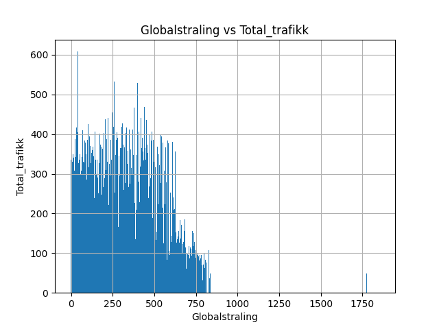
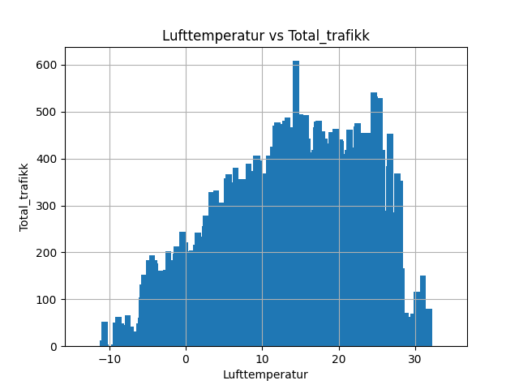
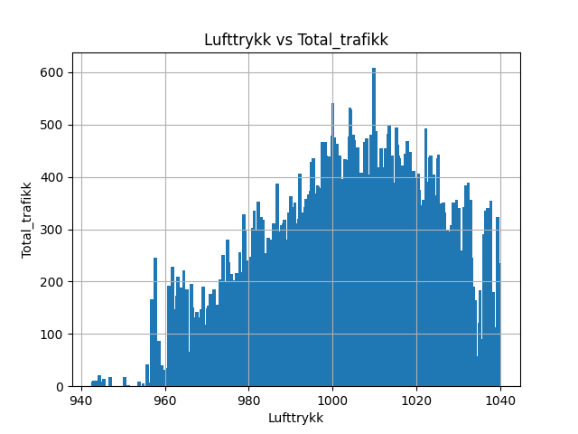
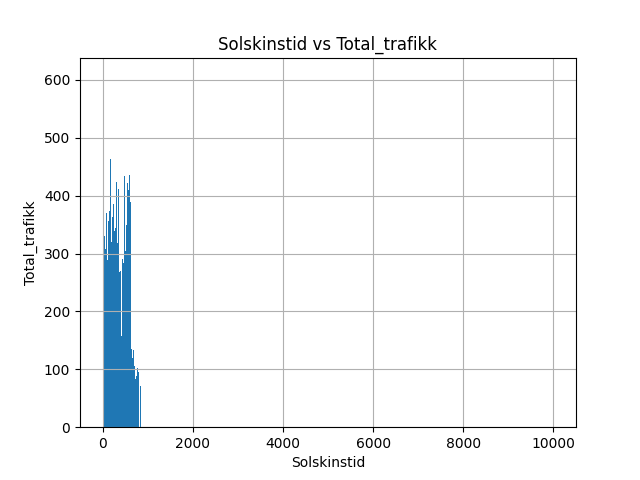
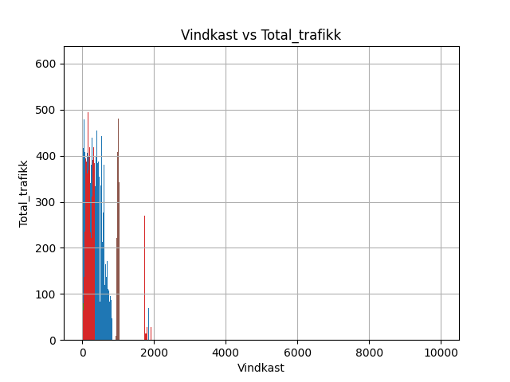
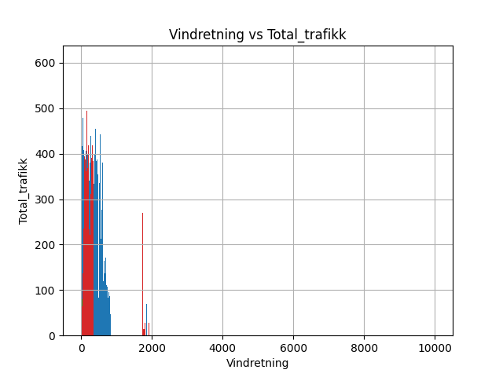
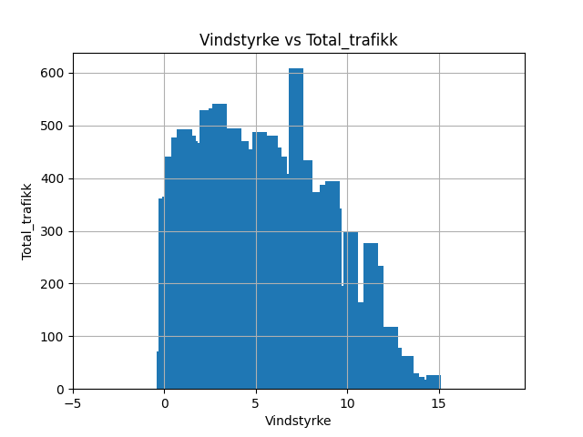

# README for INF161 data parsing

This README explains issues met, decisons made, and features added

# Data exploration:
In figs, there are images presenting each of the coloums in the final data frame, plotted against the total amount of traffic.

-------------


Looking at the *Globalstråling vs Total_trafikk* graph above, it is clear that there is some correlation between the two. The higher the "globalstråling", the less traffic, perhaps as 
the weather is better, more people walk?
The correlation is there, but not very strong.

-------------


Looking at the *Lufttemperatur vs Total_trafikk* graph above, it is clear that there is a clear correlation between the two. The higher the "lufttemperatur", the more traffic as a result. 
This will be an important variable to use when making a model.

-------------


Looking at the *Lufttrykk vs Total_trafikk* graph above, it is clear that there is a strong correlation between the two. It seems that a "middle" or average luft-trykk results in more traffic, but too high or too low, results in less traffic.
This will be an important variable to use when predicting.

-------------


Looking at the *Solskinstid vs Total_trafikk* graph above, it is hard to say if there is a clear correlation between the two.
It seems that when solskinstid = 0, there is a lot of traffic, which sound a bit unrealsitic?
If there is a lot of sun, there is more traffic, but there is not a clear correlation.
This will be an OK variable to use when predicting.

-------------


Looking at the *Vindkast vs Total_trafikk*  graph above, it is clear that there is a strong correlation between the two. At values between 0-10, there is not much of a difference, but past 15, the increase in wind clearly causes a drop in traffic. This will be an important variable to use when predicting.

-------------


Looking at the *Vindretning vs Total_trafikk*  graph above, it is up for argument if there is a strong correlation between the two, but there is some data that can be useful.
It seems that between x=100-350 values are pretty much consistent, however a drop is seen at around 250. Values between 100-0 are also very very low, and could be reflective of something else?
This will be an OK variable to use when predicting.

-------------


Looking at the *Vindstyrke vs Total_trafikk*  graph above, it is cleae that there is a strong correlation between the two. It seems between x=0-7 values are mostly consistent in the y=500-450 range, but at x=10 to x=15, values drop fast! This will be an important variable to use when predicting.


----------------

*Overall, it seems most variables here are useful*


# Important decisons

#TODO

# Feature engineering

#TODO

These features were added:
hour: 0-24 
day: 0-31 day in month -> is this needed?
day_in_week: 0-7
month: 1-12
weekend: True/False
public holiday: True/False
Last hour traffic florida: the value of the last row's florida traffic
Last hour traffic danmarksplass: the value of the last row's danmarksplass traffic

# Issues

## With parsing

- Issue:
trafikkdata.csv has both "|" and ";" as seperators, and cant be directly opened with pd.open_csv().

- Solution:
open the file as a long string, replace all "|" with ";"
save the string as a bytes object using StringIO
open the bytes object with pd.open_csv()

## With aligning the two files

- Issue:
2022 and 2023 florida wweather files  have a coloumn "Relativ luftfuktighet" 
This seems important, and could help the model

- Solution:
Since this is missing for all the other years, it is best just to drop it


- Issue:
Weather data has 6 data points for an hour
Traffic data only has 1 data point for an hour

- Solution: 
Take the mean of the 6 values in the weather data
example:
`df_weather_resampled = df_weather.resample('H').mean() # or median()`


- Issue:
Traffic data is only in the range:
*2015-07-16 15:00:00* - *2022-12-31 00:00:00*
meanwhile weather data is in much longer from 2010-2023

- Solution: 
After merging the two frames drop all rows where values in traffic data is empty, such as the col:
`Trafikkmengde_Totalt_i_retning_Florida`


- Issue:
In *trafikkdata.csv* there are gaps in the data for trafikkmende, such as between
2015-08-20T02:00+02:00
and
2015-08-20T12:00+02:00

- Solution:
These gaps are not big enough to warrant large changes, and data is still found for 08-20 for other years, 
the model should be able to predict fine with some data loss like this. 


# Data loss?
**Below is a walkthrough of how the files have been treated, and where data loss comes from**

The final *out_file.csv* has 65266 lines of data 
This is much less than the **trafikkdata.csv** and **florida.csv** files contain!
How did we get here?

## trafikkdata.csv
**trafikkdata.csv** has *348641* lines

Looking at **trafikkdata.csv**, we see that there is a lot of missing data 
between *2023-07-01* and *2023-01-01*
348641 - 326809 = 21832 lines with no data

We drop these, and we are left with 326809 lines

Each hour has 5 values, but we only really care bout two of these (florida,danmarksplass)
the 3 other values are the same, or a combination of florida+danmarkplass
so (326809 / 5) * 2 = *130723* lines

After transforming the data and pivoting it so that 
```Trafikkmengde_Totalt_i_retning_Danmarksplass``` and ```Trafikkmengde_Totalt_i_retning_Florida```
are coloumns instead of values within the ```felt``` coloumn. 

These two new coloums contaning the data previously in the coloum ```trafikkmengde``` for their category, this again splits the amount of lines in two, as now for one hour, we can see both values for florida and danmarkplass! 
This trick is possible because all other coloums except for 
```trafikkmengde```,
```Trafikkmengde_Totalt_i_retning_Danmarksplass``` and ```Trafikkmengde_Totalt_i_retning_Florida```
were dropped, and the date is the index

130723 / 2 = *65361*

This number lines quite nicely up with the amount in our final out file: *65266*

## florida.csv

an average **florida.csv** file has *~52500* lines

but each hour has 6 values (00:00,00:10,00:20.. etc)

In order to align florida with trafikkdata, each hour should have one value, therefore the average (```mean```) of the value across the hour is taken as the value for that hour, 
this cuts files down to 

52500/6 = ~8750 lines
There are 14 florida files
14*8750 = ~122500 lines altogether

However, florida data files contain weather data from *2010-2023 (halfway through 2023)* while traffic data only goes between *2015(07-16)-2022*, this means that only
**7.5** (0.5 since only about half of the 2015 weather file is used) of the florida files are actually used, and the rest are cut out by missing values for those dates in trafikk.csv. 

- This is done since we want the model to not rely only on weather data, and lots of missing data can really effect modeling. 
- There is a point to be made for creating artifical traffic data for previous years, but ironically this is what the model is trying to do anyway (only with future years).


52500/6 = ~8750 lines
There are **7.5** florida files in use

(7*8750) + (24336/6) = ~65306 lines altogether
**NOTE** <p> (24336/6) is the amount of relevant lines in the 2015 florida weather file
(07-16 to 12-31) <p>

This aligns nicely with our previous estimate of *65266* traffic data lines.

The ***(65306-65266)= *40* *** line length discrepancy arises because of missing data in trafikkdata.csv
For example, between *2015-08-20 01:00:00* and *2015-08-20 13:00:00*, all traffic data is missing
There are atleast 111 more cases of this (`using ctrl+f` for `Totalt i retning Danmarksplass;-;`). 
Doing the math:
since, we only care about 2/5's of these lines -> 111*(2/5) = 44.4 lines
This is close enough that we can blame using the average length of florida files for the 4.4 row amount difference.


