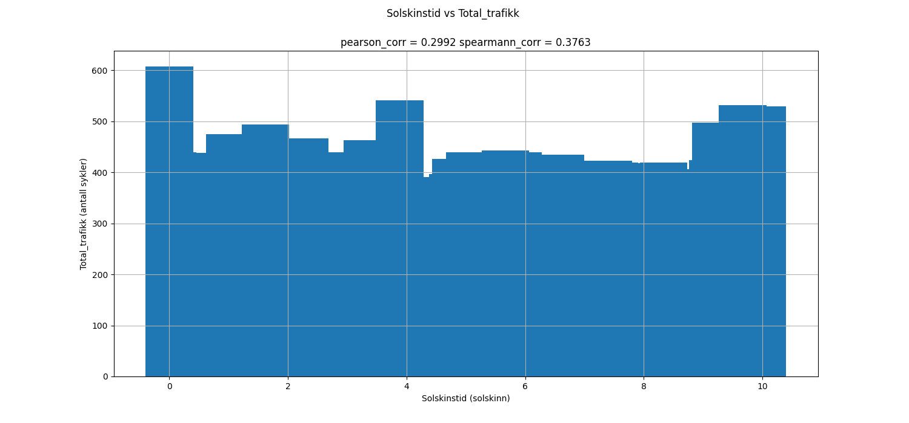
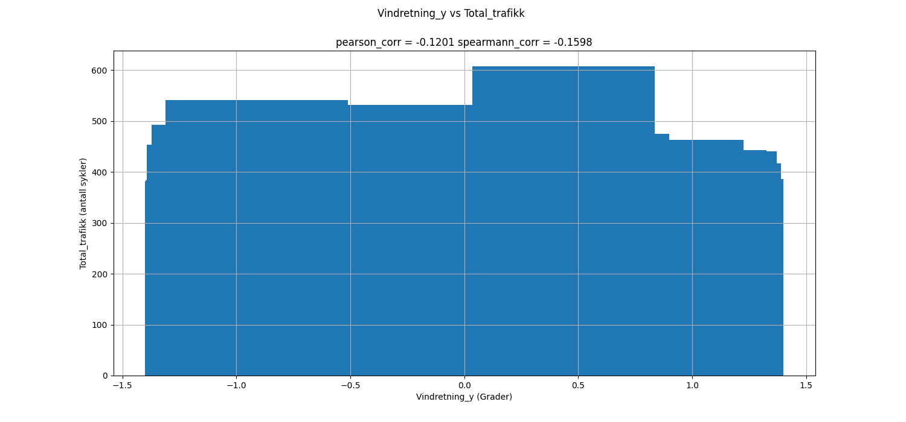
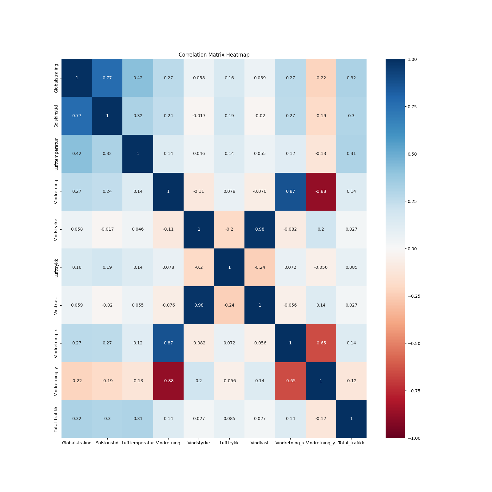

# README for INF161 data parsing

This README explains issues met, decisons made, and features added

# Data exploration:
In figs, there are images presenting each of the coloums in the final data frame, plotted against the total amount of traffic.

-------------


Looking at the *Globalstråling vs Total_trafikk* graph above, it is clear that there is some correlation between the two. The higher the "globalstråling", the less traffic, perhaps as 
the weather is better, more people walk?

With a pearson corr value of *0.2858*, this is not very strong, but can still be an indiactor of correlation.
The spearmann correlation value of *0.4472* is a good sign, and the spearmann data fits especially well since this data is monotonic.

This will be an important variable to use when making a model.

-------------


Looking at the *Lufttemperatur vs Total_trafikk* graph above, it is clear that there is a clear correlation between the two. The higher the "lufttemperatur", the more traffic as a result. 

With a pearson corr value of *0.2634*, this is not very strong, but can still be an indiactor of correlation.
The spearmann correlation value of *0.3124* is an OK sign, but the spearmann corr may not be as good of an indicator as the pearson corr since this data is not monotonic.

This will be an important variable to use when making a model.

-------------


Looking at the *Lufttrykk vs Total_trafikk* graph above, it is clear that there is a strong correlation between the two. It seems that a "middle" or average luft-trykk results in more traffic, but too high or too low, results in less traffic.

With a pearson corr value of *0.0534*, this is not very strong at all, despite what it may seem at first look.
The spearmann correlation value of *0.0499* is an also a bad sign, but the spearmann corr may not be as good of an indicator as the pearson corr since this data is not monotonic.

This will be an important variable to use when predicting.

-------------


Looking at the *Solskinstid vs Total_trafikk* graph above, it is hard to say if there is a clear correlation between the two.
It seems that when solskinstid = 0, there is a lot of traffic, which sound a bit unrealsitic?
If there is a lot of sun, there is more traffic, but there is not a clear correlation.
This will be an OK variable to use when predicting.
With a pearson corr value of *0.2398*, this is alright, despite what it may seem at first look.
It seems like the decrease in cyclicsts in regard to weather is very minimal.
The spearmann correlation value of *0.3139* is a good sign, and the spearmann corr may be a good of an indicator as the pearson corr since this data is monotonic.

-------------


Looking at the *Vindkast vs Total_trafikk*  graph above, it is clear that there is a strong correlation between the two. At values between 0-10, there is not much of a difference, but past 15, the increase in wind clearly causes a drop in traffic. 

With a pearson corr value of *0.0288*, this is not very strong at all.
The spearmann correlation value of *0.1023* is a little better, but the spearmann corr may not be as good of an indicator as the pearson corr since this data is not monotonic.

This will be an OK variable to use when predicting.

-------------




Looking at the *Vindretning vs Total_trafikk*  graph above, it is up for argument if there is a strong correlation between the two, but there is some data that can be useful.
It seems that between x=100-350 values are pretty much consistent, however a drop is seen at around 250. Values between 100-0 are also very very low, and could be reflective of something else?

With a pearson corr value of *0.0898*, this is quite weak.
The spearmann correlation value of *0.1385 is a little better, but the spearmann corr may not be as good of an indicator as the pearson corr since this data is not monotonic, and goes up and down several times.

This will be an OK variable to use when predicting.

It is important to note that the *Vindretning* Variable has values between 0-360, and if we were to calculate the mean of the 6 values per hour, and *Vindretning* looked like this : [0,0,0,0,0,365] we would end up with a value way higher than the most common value, 0. 
Therefore, first the corresponding points on a circle from the degrees were added to the data frame
*Vindretning_x* and
*Vindretning_y*, then the average of these were computed, and transformed back into degrees.

It is probably better to use *Vindretning_x* and *Vindretning_y* as two different variables, instead of just *Vindretning*, since by looking at their graphs, one can see that *Vindretning_x* has a positive pearson corr of 0.0925, and a positive spearmann_corr of 0.0832.

while *Vindretning_y* has a negative pearson_corr of -0.0989 and a negative spearmann_cor of -0.1443!

While these numbers are not very high, it is an important distinction to make that the x, and y values are together, not so useful, but divided, they can help predict traffic values.

-------------


Looking at the *Vindstyrke vs Total_trafikk*  graph above, it is clear that there is a strong correlation between the two. It seems between x=0-7 values are mostly consistent in the y=500-450 range, but at x=10 to x=15, values drop fast! 

With a pearson corr value of *0.0259*, this is quite weak, compared to what i thought at first glance.
The spearmann correlation value of *0.0923* is a little better, and the data is somewhat monotonic, so this could be an ok predictor.

This will be an OK variable to use when predicting.

-------------


Looking at the *FloridaDanmarksplass vs time* graph above, it can be seen that the two variables are very correlated.

Both of the statistical tests back this up aswell, having high values of: 
pearson = *0.0407*
spearmann = *0.8269
It is for this reason i have chosen to combine the two variables into one, as a "total traffic variable".


-------------


Looking at the *Corr matrix* graph above, it tells us alot about the correlation between variables.

Notably, the variables *Vindkast* and *Vindstyrke* have a correlation of 0.98, for the purpouses of the data, they tell us virtually the same thing, however, *Vindkast* has a correlation of 0.029 with *Total trafikk*, which is 0.003 less than between *Vindstyrke* og *Total trafikk*, this is almost nothing, but for the purpouses of this paper, i choose to keep *Vindkast*

The variables *Globalstråling* and *Solskinnstid* have a high degree of correlation, at 0.68.
This is high, but not high enough that they tell us the same thing, so i am going to keep both variables. It is also important to note that both variables have a decent degree of correlation with *Total_trafikk*, so they could both be very important.


### Variable correlation check
The variables which seem to have a good correlation with *Total_trafikk* are:

- Globalstråling (**0.29**)
The amount of radiation hitting the earth, may just seem like a reflection of *Solskinnstid*, but there could be radiation, and clouds, meaning that the two are not always linked.
This variable has the highest correlation with *Total_trafikk*, and will be valuable.

- Solskinnstid (**0.24**)
*Solskinnstid* is a good indicator of the sun, has a high correlation, and as described earlier, is different from *Globalstråling*. This will be useful

- Lufttemperatur (**0.26**)
*Lufttemperatur* is important as one could imagine, low temperature = less cyclists. 
Good correlation, will be useful. 

- Vindretning_x/Vindretning_y (**~ +/- 0.1**)
*Vindretning* is actually very useful, since it can tell us something about the rain! Rain is something we would love to know, but this is perhaps a close approximation. 
As talked about above, the x and y directions the wind comes from, was more important that just the general direction as degrees.
This will be useful.

I will therefore be removing "Vindretning" from the final dataframe, as Vindretning_x Vindretning_y are much more useful.
This can be also seen in the correlation matrix, where *Vindretning_x* and *Vindretning* have virtually the same score of -0.099 and -0.09 respectively. 
Splitting this variable up will be useful i hope. 

----------------
*Simply put*

- Remove vindstyrke
- Remove vindretning in favour of Vindretning_x and Vindretning_y 
- Most variables here are useful


# Important decisons

#TODO

# Feature engineering

### These features were added:

**Hour**
From the date, the hour was added as a coloumn. This can help the model make a link between hour and traffic
Range: 0-24
-----------------------------------

**Day_in_week**
From the date, the day in the week was added, This will help the model make a link between days and traffic
Range: 0-7
-----------------------------------

**Month**
From the date, the month was added as a coloumn. This can help the model make a link between time of year and traffic
Range: 1-12
-----------------------------------

**Weekend**
From the date, a 0/1 coloumn for if it is a weekend or not was added. This can help the model make a link between time of week and traffic
Range: 0/1
-----------------------------------

**Public_holiday**
From the date, a 0/1 coloumn for if it is a public holiday or not was added. This can help the model make a link between specials days of the year and traffic.
Range: 0/1
-----------------------------------

### Considered Features that were dropped

**Total traffic in retning danmarkplass**,
**Total traffic in retning florida**,

The reason adding this coloumn doesnt work is, well, if we know how much traffic there is, there is no point in guessing how much traffic there is

Range: 0/?
-----------------------------------

**Last_Total traffic in retning florida**,
**Last_Total traffic in retning danmarksplass**,
**Last_Total traffic**,

This coloumn would be the value for traffic in the previous row.
The reason adding this coloumn doesnt work is that it is much harder to train the model when you have to train one line at a time, and use the last row's value's as training values. 
This could also be a big problem because if we guess wrong on the next traffic, that value will be brought with to the next row's guess, and further for ALL the rows, and if that value is wrong, well then ALL the guesses are potentially wrong. 

Range: 0/?
-----------------------------------
**Day in month**
This coloumn would tell us what day in the month it is, but this is a bit overkill considering the other values we have, and i dont expect traffic to fluctuate a lot betwene the start and the end of the month.

Range : 1-31

# Issues

## With parsing

- Issue:
trafikkdata.csv has both "|" and ";" as seperators, and cant be directly opened with pd.open_csv().

- Solution:
open the file as a long string, replace all "|" with ";"
save the string as a bytes object using StringIO
open the bytes object with pd.open_csv()

----------------

## With aligning the two files

- Issue:
2022 and 2023 florida wweather files  have a coloumn "Relativ luftfuktighet" 
This seems important, and could help the model

- Solution:
Since this is missing for all the other years, it is best just to drop it

----------------

- Issue:
Weather data has 6 data points for an hour
Traffic data only has 1 data point for an hour

- Solution: 
Take the mean of the 6 values in the weather data
example:
`df_weather_resampled = df_weather.resample('H').mean() # or median()`

----------------

- Issue:
Traffic data is only in the range:
*2015-07-16 15:00:00* - *2022-12-31 00:00:00*
meanwhile weather data is in much longer from 2010-2023

- Solution: 
After merging the two frames drop all rows where values in traffic data is empty, such as the col:
`Trafikkmengde_Totalt_i_retning_Florida`

----------------

- Issue:
In *trafikkdata.csv* there are gaps in the data for trafikkmende, such as between
2015-08-20T02:00+02:00
and
2015-08-20T12:00+02:00

- Solution:
These gaps are not big enough to warrant large changes, and data is still found for 08-20 for other years, 
the model should be able to predict fine with some data loss like this. 

----------------

# Data loss
**Below is a walkthrough of how the files have been treated, and where data loss comes would come from**

The final *out_file.csv* has 65266 lines of data (before splitting into train,validation and test data)

This is much less than the **trafikkdata.csv** and **florida.csv** files contain!
How did we get here?

## trafikkdata.csv
**trafikkdata.csv** has *348641* lines

Looking at **trafikkdata.csv**, we see that there is a lot of missing data 
between *2023-07-01* and *2023-01-01*
348641 - 326809 = 21832 lines with no data

We drop these, and we are left with 326809 lines

Each hour has 5 values, but we only really care bout two of these (florida,danmarksplass)
the 3 other values are the same, or a combination of florida+danmarkplass
so (326809 / 5) * 2 = *130723* lines

After transforming the data and pivoting it so that 
```Trafikkmengde_Totalt_i_retning_Danmarksplass``` and ```Trafikkmengde_Totalt_i_retning_Florida```
are coloumns instead of values within the ```felt``` coloumn. 

These two new coloums contaning the data previously in the coloum ```trafikkmengde``` for their category, this again splits the amount of lines in two, as now for one hour, we can see both values for florida and danmarkplass! 
This trick is possible because all other coloums except for 
```trafikkmengde```,
```Trafikkmengde_Totalt_i_retning_Danmarksplass``` and ```Trafikkmengde_Totalt_i_retning_Florida```
were dropped, and the date is the index

130723 / 2 = *65361*

This number lines quite nicely up with the amount in our final out file: *65266*

## florida.csv

an average **florida.csv** file has *~52500* lines

but each hour has 6 values (00:00,00:10,00:20.. etc)

In order to align florida with trafikkdata, each hour should have one value, therefore the average (```mean```) of the value across the hour is taken as the value for that hour, 
this cuts files down to 

52500/6 = ~8750 lines
There are 14 florida files
14*8750 = ~122500 lines altogether

However, florida data files contain weather data from *2010-2023 (halfway through 2023)* while traffic data only goes between *2015(07-16)-2022*, this means that only
**7.5** (0.5 since only about half of the 2015 weather file is used) of the florida files are actually used, and the rest are cut out by missing values for those dates in trafikk.csv. 

- This is done since we want the model to not rely only on weather data, and lots of missing data can really effect modeling. 
- There is a point to be made for creating artifical traffic data for previous years, but ironically this is what the model is trying to do anyway (only with future years).


52500/6 = ~8750 lines
There are **7.5** florida files in use

(7*8750) + (24336/6) = ~65306 lines altogether
**NOTE** <p> (24336/6) is the amount of relevant lines in the 2015 florida weather file
(07-16 to 12-31) <p>

This aligns nicely with our previous estimate of *65266* traffic data lines.

The ***(65306-65266)= *40* *** line length discrepancy arises because of missing data in trafikkdata.csv
For example, between *2015-08-20 01:00:00* and *2015-08-20 13:00:00*, all traffic data is missing
There are atleast 111 more cases of this (`using ctrl+f` for `Totalt i retning Danmarksplass;-;`). 
Doing the math:
since, we only care about 2/5's of these lines -> 111*(2/5) = 44.4 lines
This is close enough that we can blame using the average length of florida files for the 4.4 row amount difference.

### Splitting data into train,test,validation

Data was split like this:

type      |percent of wholedata   
----------|--------------------
training  | 70%
test      | 15%
validation| 15%

This was done using ```train_test_split()```
from ```sklearn.model_selection```
    


