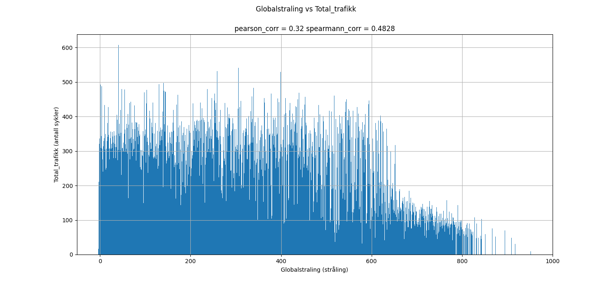
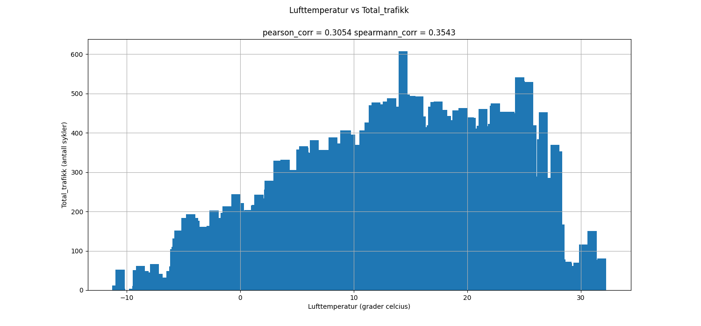
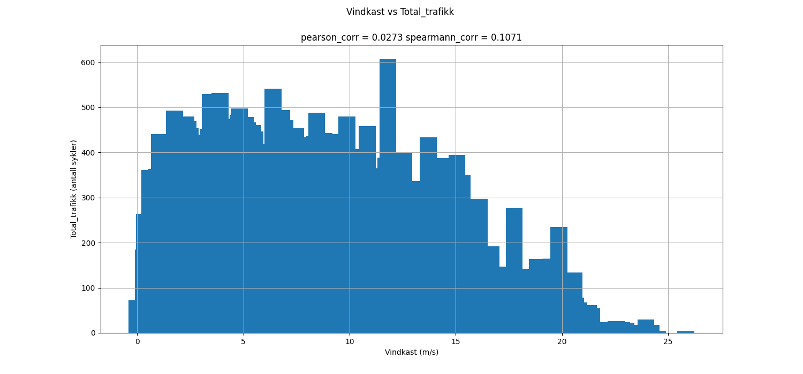
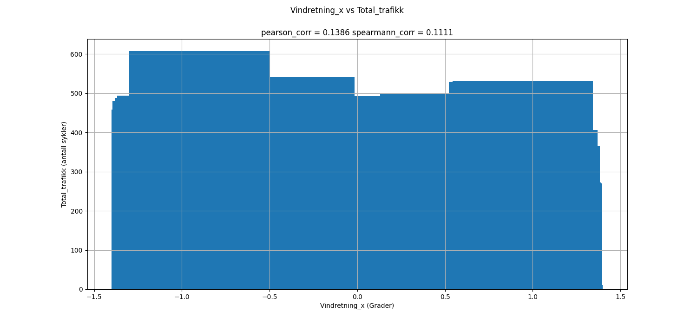
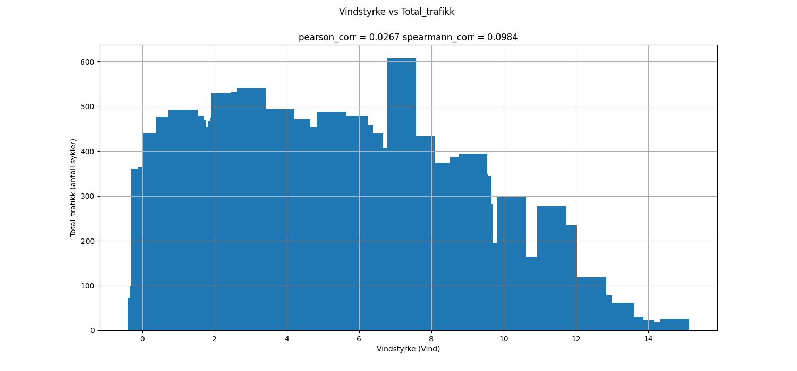
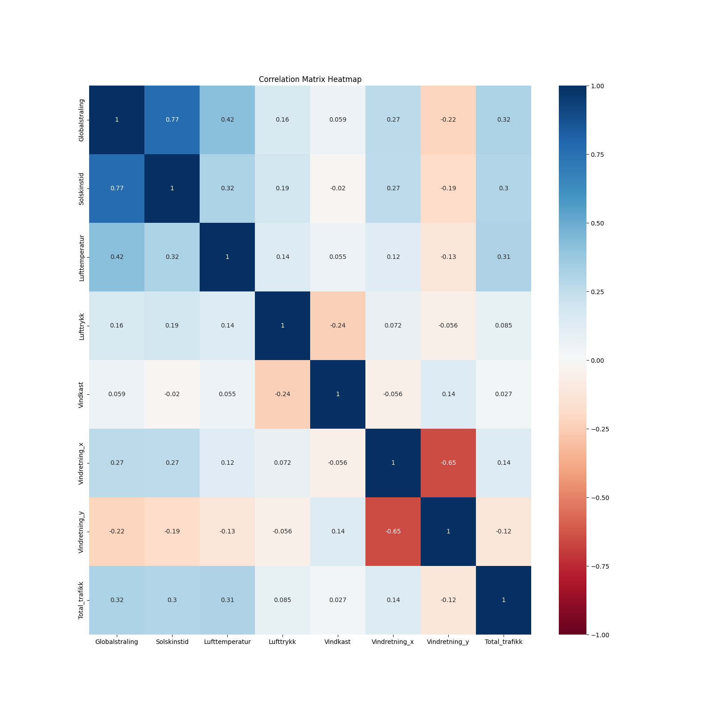
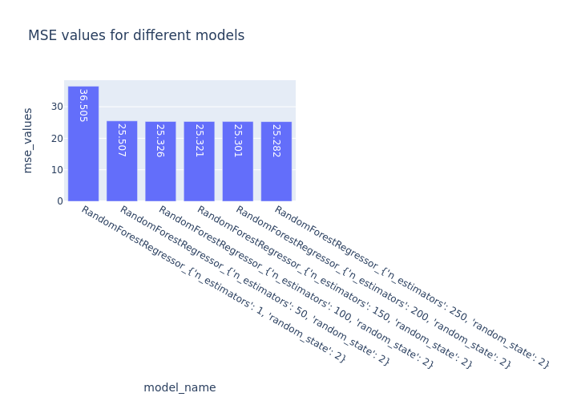

# README for INF161 data parsing

***If I'm not in PDF format, please open me in markdown formatting! (in vscode there is a button in the top right.)***

This README pertains to the INF161 project this fall, in creating a model which can guess bike traffic across nygårdsbroen.

### TODO

- fix values in readme that have now been updated

- evulate multiple models

- update data loss parsing section

- predict data for 2023 days 
  - fix the dataframe for 2023 with the features too!

- create website

- conda and lock file

- cleanup files that may not be used

- run again since changed sleeptime

- FEATURES TO ADD: 
  - good weather and weekend


# Data exploration:
In src/figs, there are images presenting each of the coloums in the final data frame, plotted against the total amount of traffic.

**SOME OF THE VALUES IN THIS ARE WRONG: THIS IS TO BE FIXED SEE TODO**
-------------


Looking at the *Globalstråling vs Total_trafikk* graph above, it is clear that there is some correlation between the two. The higher the "globalstråling", the less traffic, perhaps as 
the weather is better, more people walk?

With a pearson corr value of *0.2858*, this is not very strong, but can still be an indiactor of correlation.
The spearmann correlation value of *0.4472* is a good sign, and the spearmann data fits especially well since this data is monotonic.

This will be an important variable to use when making a model.

-------------


Looking at the *Lufttemperatur vs Total_trafikk* graph above, it is clear that there is a clear correlation between the two. The higher the "lufttemperatur", the more traffic as a result. 

With a pearson corr value of *0.2634*, this is not very strong, but can still be an indiactor of correlation.
The spearmann correlation value of *0.3124* is an OK sign, but the spearmann corr may not be as good of an indicator as the pearson corr since this data is not monotonic.

This will be an important variable to use when making a model.

-------------


Looking at the *Lufttrykk vs Total_trafikk* graph above, it is clear that there is a strong correlation between the two. It seems that a "middle" or average luft-trykk results in more traffic, but too high or too low, results in less traffic.

With a pearson corr value of *0.0534*, this is not very strong at all, despite what it may seem at first look.
The spearmann correlation value of *0.0499* is an also a bad sign, but the spearmann corr may not be as good of an indicator as the pearson corr since this data is not monotonic.

This will be an important variable to use when predicting.

-------------


Looking at the *Solskinstid vs Total_trafikk* graph above, it is hard to say if there is a clear correlation between the two.
It seems that when solskinstid = 0, there is a lot of traffic, which sound a bit unrealsitic?
If there is a lot of sun, there is more traffic, but there is not a clear correlation.
This will be an OK variable to use when predicting.
With a pearson corr value of *0.2398*, this is alright, despite what it may seem at first look.
It seems like the decrease in cyclicsts in regard to weather is very minimal.
The spearmann correlation value of *0.3139* is a good sign, and the spearmann corr may be a good of an indicator as the pearson corr since this data is monotonic.

-------------



TODO: maybe expotnailly transofrm the data (opposite of log transform)


Looking at the *Vindkast vs Total_trafikk*  graph above, it is clear that there is a strong correlation between the two. At values between 0-10, there is not much of a difference, but past 15, the increase in wind clearly causes a drop in traffic. 

With a pearson corr value of *0.0288*, this is not very strong at all.
The spearmann correlation value of *0.1023* is a little better, but the spearmann corr may not be as good of an indicator as the pearson corr since this data is not monotonic.

This will be an OK variable to use when predicting.

-------------




Looking at the *Vindretning vs Total_trafikk*  graph above, it is up for argument if there is a strong correlation between the two, but there is some data that can be useful.
It seems that between x=100-350 values are pretty much consistent, however a drop is seen at around 250. Values between 100-0 are also very very low, and could be reflective of something else?

With a pearson corr value of *0.0898*, this is quite weak.
The spearmann correlation value of *0.1385 is a little better, but the spearmann corr may not be as good of an indicator as the pearson corr since this data is not monotonic, and goes up and down several times.

This will be an OK variable to use when predicting.

It is important to note that the *Vindretning* Variable has values between 0-360, and if we were to calculate the mean of the 6 values per hour, and *Vindretning* looked like this : [0,0,0,0,0,365] we would end up with a value way higher than the most common value, 0. 
Therefore, first the corresponding points on a circle from the degrees were added to the data frame
*Vindretning_x* and
*Vindretning_y*, then the average of these were computed, and transformed back into degrees.

It is probably better to use *Vindretning_x* and *Vindretning_y* as two different variables, instead of just *Vindretning*, since by looking at their graphs, one can see that *Vindretning_x* has a positive pearson corr of 0.0925, and a positive spearmann_corr of 0.0832.

while *Vindretning_y* has a negative pearson_corr of -0.0989 and a negative spearmann_cor of -0.1443!

While these numbers are not very high, it is an important distinction to make that the x, and y values are together, not so useful, but divided, they can help predict traffic values.

-------------


Looking at the *Vindstyrke vs Total_trafikk*  graph above, it is clear that there is a strong correlation between the two. It seems between x=0-7 values are mostly consistent in the y=500-450 range, but at x=10 to x=15, values drop fast! 

With a pearson corr value of *0.0259*, this is quite weak, compared to what i thought at first glance.
The spearmann correlation value of *0.0923* is a little better, and the data is somewhat monotonic, so this could be an ok predictor.

This will be an OK variable to use when predicting.

-------------


Looking at the *FloridaDanmarksplass vs time* graph above, it can be seen that the two variables are very correlated.

Both of the statistical tests back this up aswell, having high values of: 
pearson = *0.0407*
spearmann = *0.8269
It is for this reason i have chosen to combine the two variables into one, as a "total traffic variable".


-------------


Looking at the *Corr matrix* graph above, it tells us alot about the correlation between variables.

Notably, the variables *Vindkast* and *Vindstyrke* have a correlation of 0.98, for the purpouses of the data, they tell us virtually the same thing, however, *Vindkast* has a correlation of 0.029 with *Total trafikk*, which is 0.003 less than between *Vindstyrke* og *Total trafikk*, this is almost nothing, but for the purpouses of this paper, i choose to keep *Vindkast*

The variables *Globalstråling* and *Solskinnstid* have a high degree of correlation, at 0.68.
This is high, but not high enough that they tell us the same thing, so i am going to keep both variables. It is also important to note that both variables have a decent degree of correlation with *Total_trafikk*, so they could both be very important.


### Variable correlation check
The variables which seem to have a good correlation with *Total_trafikk* are:

- Globalstråling (**0.29**)
The amount of radiation hitting the earth, may just seem like a reflection of *Solskinnstid*, but there could be radiation, and clouds, meaning that the two are not always linked.
This variable has the highest correlation with *Total_trafikk*, and will be valuable.

- Solskinnstid (**0.24**)
*Solskinnstid* is a good indicator of the sun, has a high correlation, and as described earlier, is different from *Globalstråling*. This will be useful

- Lufttemperatur (**0.26**)
*Lufttemperatur* is important as one could imagine, low temperature = less cyclists. 
Good correlation, will be useful. 

- Vindretning_x/Vindretning_y (~ +/- **0.1**)
*Vindretning* is actually very useful, since it can tell us something about the rain! Rain is something we would love to know, but this is perhaps a close approximation. 
As talked about above, the x and y directions the wind comes from, was more important that just the general direction as degrees.
This will be useful.

I will therefore be removing "Vindretning" from the final dataframe, as Vindretning_x Vindretning_y are much more useful.
This can be also seen in the correlation matrix, where *Vindretning_x* and *Vindretning* have virtually the same score of -0.099 and -0.09 respectively. 
Splitting this variable up will be useful i hope. 

----------------
*Simply put*

- Remove *Vindstyrke* in favour of *Vindkast*
- Remove *Vindretning* in favour of *Vindretning_x* and *Vindretning_y* 
- Most variables here are useful

### Normalized values


- *Globalstraling*

<p>
These values are between 0-1000, and could therefore be normalized to a 0-1 scale without much data loss
<p>

- *Luftrykk*

<p>
These values are between 940-1050, and normalizing these values to a 0-1 scale could help the model understand the numbers.
<p>

- *Solskinnstid*

<p>
These values are between 0-10, and could therefore be normalized to a 0-1 scale without much data loss
<p>

- *Vindkast*

["graph"]("src/figs/VindkastVSTotal_trafikk.png")

<p>
These values are between 0-25, but there is a clear link between high vindkast and low traffic, so by squaring the values of vindkast could help the model understand that higher numbers mean a large descrease in traffic, while lower numbers do not have an effect on traffic.

### Dropped coloumns

- *Vindstyrke*

<p>
Vindstyrke and vindkast have a high degree of correlation, and statistically, it is like having the same variable two times. The two variables also have a very similar correlation with traffic amounts. Vindstyrke was dropped, as vindkast had a slightly higher correlation to traffic. 
<p>

- *Vindretning/Vindretning_radians*

<p>
These have been transformed to Vindretning_x and Vindretning_y which provide more information about the variables.
<p>

- *Relativ luftfuktighet*

<p>
Drop "Relativ luftfuktighet" as this data only exists in 2022 and 2023. While this would be very valuable, its hard to train a dataset with a lot of missing data. 
<p>

- *Data in traffic files*

``` json

    columns=[
        "Trafikkregistreringspunkt",
        "Navn",
        "Vegreferanse",
        "Fra",
        "Til",
        "Dato",
        "Fra tidspunkt",
        "Til tidspunkt",
        "Dekningsgrad (%)",
        "Antall timer total",
        "Antall timer inkludert",
        "Antall timer ugyldig",
        "Ikke gyldig lengde",
        "Lengdekvalitetsgrad (%)",
        "< 5,6m",
        ">= 5,6m",
        "5,6m - 7,6m",
        "7,6m - 12,5m",
        "12,5m - 16,0m",
        ">= 16,0m",
        "16,0m - 24,0m",
        ">= 24,0m",
    ]

```

These coloumns do not really tell us much, and could really just confuse the model. 


### Dropped values

- *Globalstråling*

<p> When values above 1000 in **Globalstraling** are dropped, </p>
114 rows are lost

This value was chosen because values over this are only observed "ved atmosfærenses yttergrense"

[ref]("https://veret.gfi.uib.no/") 

- *Solskinnstid*

<p>
When values above 10.01 in **Solskinstid** are dropped </p>
18 rows are lost, this scale is between 0-10

[ref]("https://veret.gfi.uib.no/") 

- *Lufttrykk*

<p>
When values above 1050 in **Lufttrykk** are dropped </p>
0 rows are lost.

935 and 1050 are the min/max records of all time. 

[ref]("https://en.wikipedia.org/wiki/List_of_atmospheric_pressure_records_in_Europe") 


- *Luftemperatur*

<p>
When values above 37 in **Lufttemperatur** are dropped </p>
482 values are lost.

Over 37 degrees is not realistic for norway, as the warmest ever recorded was 35.6 degrees

[ref]("https://no.wikipedia.org/wiki/Norske_v%C3%A6rrekorder") 

- *Vindkast*

<p>
When values above 65 in **Vindkast** are dropped </p>
0 values are lost. So no difference.

Over 65m/s is not realistic for norway, as the highest value ever recorded was 64,7m/s

[ref]("https://no.wikipedia.org/wiki/Norske_v%C3%A6rrekorder") 

- *Vindretning*

<p>
When values above 360 in **Vindretning** are dropped </p>
--- values are lost.

Since vindretning is measured from 0-360, there is no way a degrees of more than 360 could be measured.


# Feature engineering

### These features were added:

- *Hour*
<p> From the date, the hour was added as a coloumn. This can help the model make a link between hour and traffic 
</p>
Range: 0-24

-----------------------------------

- *Day_in_week*
<p> From the date, the day in the week was added, This will help the model make a link between days and traffic
</p>
Range: 0-7

-----------------------------------

- *Month*
<p> From the date, the month was added as a coloumn. This can help the model make a link between time of year and traffic
</p>
Range: 1-12

-----------------------------------

- *Weekend*
<p> From the date, a 0/1 coloumn for if it is a weekend or not was added. This can help the model make a link between time of week and traffic
</p>
Range: 0/1

-----------------------------------

- *Public_holiday*
<p> From the date, a 0/1 coloumn for if it is a public holiday or not was added. This can help the model make a link between specials days of the year and traffic.
</p>
Range: 0/1

-----------------------------------

- *Raining*
<p> From the air pressure, a 0/1 coloumn for if it is raining or not was added. Rain and air pressure are not directly linked, but it may be possible to guess weather from air pressure. Reference:

[Rain link]("https://geo.libretexts.org/Bookshelves/Oceanography/Oceanography_101_(Miracosta)/08%3A_Atmospheric_Circulation/8.08%3A_How_Does_Air_Pressure_Relate_to_Weather)

</p>
Range: 0/1

-----------------------------------

- *Summer*
<p> From the months, a 0/1 coloumn that specificed if it is summer or not was added (June-July)

</p>
Range: 0/1

-----------------------------------

- *Winter*
<p> From the months, a 0/1 coloumn that specificed if it is summer or not was added (October-Feburary)

</p>
Range: 0/1

-----------------------------------

- *Rush hour*
<p> From the months, a 0/1 coloumn that specificed if the hour is a rush hour (7-9 and 15-17)

</p>
Range: 0/1

-----------------------------------

- *Nightime*
<p> From the months, a 0/1 coloumn that specificed if the hour is in the middle of the night (22-6)

</p>
Range: 0/1

-----------------------------------

- *Vindretning_x/Vindretning_y*
<p> Vindretning contains values between 0-360, and these are transformed to points on a circle

```python

    df["Vindretning_radians"] = np.radians(df["Vindretning"])
    df["Vindretning_x"] = np.cos(df["Vindretning_radians"])
    df["Vindretning_y"] = np.sin(df["Vindretning_radians"])

```

</p>
Range: -1/1

-----------------------------------

- *Total_trafikk*
<p> The numbers for the two rows of traffic were combined to one. 

</p>
Range: N/A

-----------------------------------

### Considered Features that were dropped

- *Total traffic in retning danmarkplass*,
- *Total traffic in retning florida*,

<p> The reason adding this coloumn doesnt work is, well, if we know how much traffic there is, there is no point in guessing how much traffic there is. 
</p>

Range: N/A

-----------------------------------

- *Last_Total traffic in retning florida*,
- *Last_Total traffic in retning danmarksplass*,
- *Last_Total traffic*,

<p> This coloumn would be the value for traffic in the previous row.
The reason adding this coloumn doesnt work is that it is much harder to train the model when you have to train one line at a time, and use the last row's value's as training values. 
This could also be a big problem because if we guess wrong on the next traffic, that value will be brought with to the next row's guess, and further for ALL the rows, and if that value is wrong, well then ALL the guesses are potentially wrong. 
</p>

Range: N/A

-----------------------------------
- *Day in month*

<p> This coloumn would tell us what day in the month it is, but this is a bit overkill considering the other values we have, and i dont expect traffic to fluctuate a lot between the start and the end of the month.
</p>

Range : 1-31

# Issues

## With parsing

- Issue:
trafikkdata.csv has both "|" and ";" as seperators, and cant be directly opened with pd.open_csv().

- Solution:
open the file as a long string, replace all "|" with ";"
save the string as a bytes object using StringIO
open the bytes object with pd.open_csv()

----------------

## With aligning the two files

- Issue:
2022 and 2023 florida wweather files  have a coloumn "Relativ luftfuktighet" 
This seems important, and could help the model

- Solution:
Since this is missing for all the other years, it is best just to drop it

----------------

- Issue:
Weather data has 6 data points for an hour
Traffic data only has 1 data point for an hour

- Solution: 
Take the mean of the 6 values in the weather data
example:
`df_weather_resampled = df_weather.resample('H').mean() # or median()`

----------------

- Issue:
Traffic data is only in the range:
*2015-07-16 15:00:00* - *2022-12-31 00:00:00*
meanwhile weather data is in much longer from 2010-2023

- Solution: 
After merging the two frames drop all rows where values in traffic data is empty, such as the col:
`Trafikkmengde_Totalt_i_retning_Florida`

----------------

- Issue:
In *trafikkdata.csv* there are gaps in the data for trafikkmende, such as between
2015-08-20T02:00+02:00
and
2015-08-20T12:00+02:00

- Solution:
These gaps are not big enough to warrant large changes, and data is still found for 08-20 for other years, 
the model should be able to predict fine with some data loss like this. 

----------------

# Data loss

:warning: **THIS NEEDS TO BE UPDATED SINCE PARSING IS NOW A BIT DIFFERENT**


**Below is a walkthrough of how the files have been treated, and where data loss comes would come from**

The final *out_file.csv* has 64652 lines of data (before splitting into train,validation and test data)

This is much less than the **trafikkdata.csv** and **florida.csv** files contain!
How did we get here?

## trafikkdata.csv
**trafikkdata.csv** has *348641* lines

Looking at **trafikkdata.csv**, we see that there is a lot of missing data 
between *2023-07-01* and *2023-01-01*
348641 - 326809 = 21832 lines with no data

We drop these, and we are left with 326809 lines

Each hour has 5 values, but we only really care bout two of these (florida,danmarksplass)
the 3 other values are the same, or a combination of florida+danmarkplass
so (326809 / 5) * 2 = *130723* lines

After transforming the data and pivoting it so that 
```Trafikkmengde_Totalt_i_retning_Danmarksplass``` and ```Trafikkmengde_Totalt_i_retning_Florida```
are coloumns instead of values within the ```felt``` coloumn. 

These two new coloums contaning the data previously in the coloum ```trafikkmengde``` for their category, this again splits the amount of lines in two, as now for one hour, we can see both values for florida and danmarkplass! 
This trick is possible because all other coloums except for 
```trafikkmengde```,
```Trafikkmengde_Totalt_i_retning_Danmarksplass``` and ```Trafikkmengde_Totalt_i_retning_Florida```
were dropped, and the date is the index

130723 / 2 = *65361*

This number lines up almost quite nicely up with the amount in our final out file: *64652*

## florida.csv

an average **florida.csv** file has *~52500* lines

but each hour has 6 values (00:00,00:10,00:20.. etc)

In order to align florida with trafikkdata, each hour should have one value, therefore the average (```mean```) of the value across the hour is taken as the value for that hour, 
this cuts files down to 

52500/6 = ~8750 lines
There are 14 florida files
14*8750 = ~122500 lines altogether

However, florida data files contain weather data from *2010-2023 (halfway through 2023)* while traffic data only goes between *2015(07-16)-2022*, this means that only
**7.5** (0.5 since only about half of the 2015 weather file is used) of the florida files are actually used, and the rest are cut out by missing values for those dates in trafikk.csv. 

- This is done since we want the model to not rely only on weather data, and lots of missing data can really effect modeling. 
- There is a point to be made for creating artifical traffic data for previous years, but ironically this is what the model is trying to do anyway (only with future years).


52500/6 = ~8750 lines
There are **7.5** florida files in use

(7*8750) + (24336/6) = ~65266 lines altogether
**NOTE** <p> (24336/6) is the amount of relevant lines in the 2015 florida weather file
(07-16 to 12-31) <p>

This aligns almost quite nicely with our previous estimate of *64652* traffic data lines.

The discrepency in length comes from severe outliers.
*65266 - 64652 = 614 lines too many*

When dropping unreasonable values in ```dataframe_handling.py```, see above sections for this. 


### Splitting data into train,test,validation

Data was split like this:

type      |percent of wholedata| 
----------|--------------------|
training  | 70%                |
test      | 15%                |
validation| 15%                |

This was done using ```train_test_split()```
from ```sklearn.model_selection```
    


# RESULTS :

**TODO**
 - Er resultater av tre fundamentalt forskjellige modeller rapportert?
 - Update graphs to be easier to read


One can see that RandomForestRegressor with n_estimators; 200 is the best model with a RMSE of 25.301.

---------------------------

After finding the best model, i tried finding hyper-parameters that worked well



Seeminlgy, a higher n_estimators yeiled slightly better results. 

This may need to be explored further, but attempts to train past 250 n_estimators results in a slowed console and after a while the text "Killed", so i think that may be a warning. 


--------------------------

After finding the best model and seeing how it worked on validation data, we can use the ```best_model.feature_importances_``` ouput to evaluate importance of coloumns.

```
           Feature  Importance
19       rush_hour    0.327215
14         weekend    0.183384
5             hour    0.169680
2   Lufttemperatur    0.118050
13           month    0.047983
0   Globalstraling    0.030485
3        Lufttrykk    0.023065
4         Vindkast    0.019096
21   Vindretning_x    0.016211
22   Vindretning_y    0.014236
1      Solskinstid    0.012497
17          summer    0.012343
15  public_holiday    0.009316
6         d_Friday    0.007574
7         d_Monday    0.002153
10      d_Thursday    0.002080
11       d_Tuesday    0.001653
12     d_Wednesday    0.001210
18          winter    0.000853
16         raining    0.000562
8       d_Saturday    0.000182
9         d_Sunday    0.000173
20       sleeptime    0.000000
```

##  TEST DATA:
--------------------------

After finding the best model, we can check it against test data, and use ```best_model.feature_importances_``` ouput and RMSE to evaluate the model.

This provides us with this ouput:

```
Test MSE: 628.8209982433501
Test RMSE: 25.07630352032273
           Feature  Importance
19       rush_hour    0.327215
14         weekend    0.183384
5             hour    0.169680
2   Lufttemperatur    0.118050
13           month    0.047983
0   Globalstraling    0.030485
3        Lufttrykk    0.023065
4         Vindkast    0.019096
21   Vindretning_x    0.016211
22   Vindretning_y    0.014236
1      Solskinstid    0.012497
17          summer    0.012343
15  public_holiday    0.009316
6         d_Friday    0.007574
7         d_Monday    0.002153
10      d_Thursday    0.002080
11       d_Tuesday    0.001653
12     d_Wednesday    0.001210
18          winter    0.000853
16         raining    0.000562
8       d_Saturday    0.000182
9         d_Sunday    0.000173
20       sleeptime    0.000000
```

This shows us that the model has a RMSE of
```25.076``` which is pretty good considerding the ```DummyRegressor``` has a RMSE of ```Test RMSE: 67.007``` on test data! 